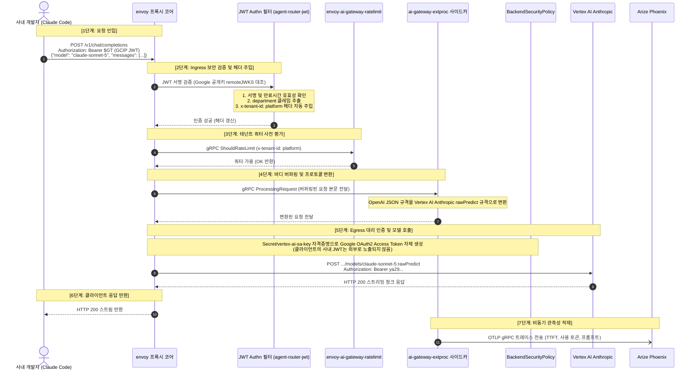
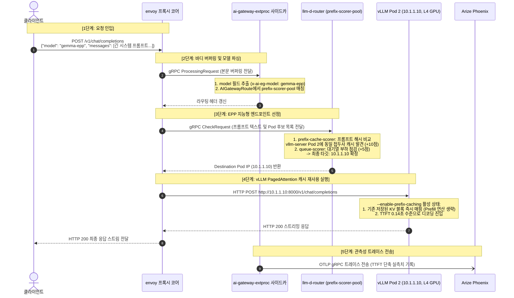
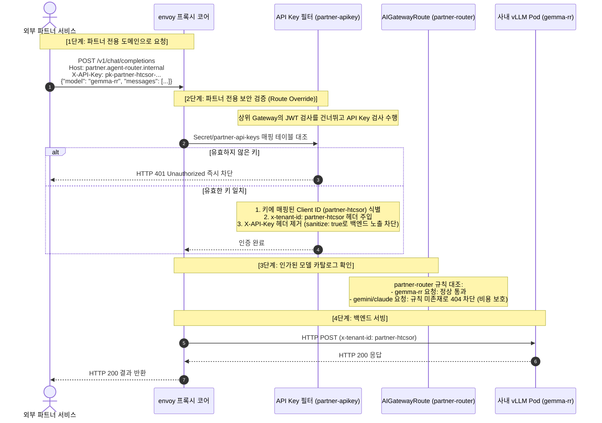
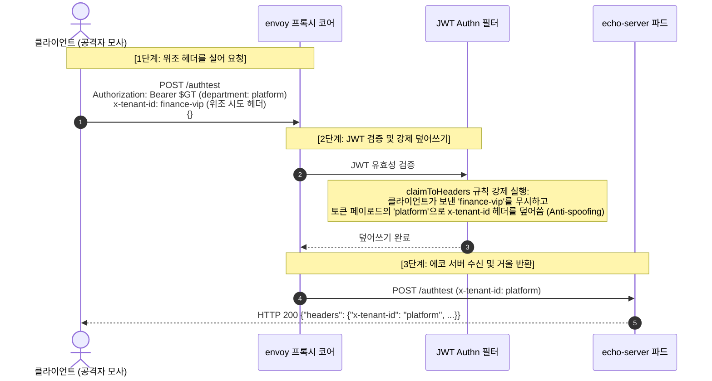

# Envoy AI Gateway 및 추론 요청 처리 아키텍처

> **Languages:** [English](architecture-request-flow.md) | [한국어](architecture-request-flow.kr.md)

이 문서는 GKE 상에 배포된 Envoy AI Gateway, Kubernetes Gateway API Inference Extension(GIE), llm-d-router(EPP), vLLM 서빙 엔진, Vertex AI(Gemini 및 Claude), Arize Phoenix 관측성, 3대 다중 인증(GCIP JWT, Google SA 토큰, 파트너 API Key), Redis 기반 듀얼 사용량 속도 제한과 쿼터 정책의 최신 엔드투엔드 요청 처리 흐름을 정리한 종합 설계 문서입니다.

---

## 1. 전체 컴포넌트 및 네임스페이스 매핑 구조도

클라이언트 유형별 요청이 도달하여 처리되기까지 거치는 네임스페이스별 파드와 설정 매핑 구조입니다.

```mermaid
flowchart TD
    classDef client fill:#f1f3f4,stroke:#5f6368,stroke-width:2px;
    classDef lb fill:#fef7e0,stroke:#fbbc04,stroke-width:2px;
    classDef envoy fill:#e8f0fe,stroke:#4285f4,stroke-width:2px;
    classDef sec fill:#fce8e6,stroke:#ea4335,stroke-width:2px;
    classDef route fill:#e6f4ea,stroke:#34a853,stroke-width:2px;
    classDef rls fill:#f3e8fd,stroke:#a142f4,stroke-width:2px;
    classDef backend fill:#e8eaed,stroke:#202124,stroke-width:2px;
    classDef obs fill:#e0f2f1,stroke:#00897b,stroke-width:2px;

    subgraph ClientLayer["1. 클라이언트 계층"]
        C_Emp["사내 임직원 / Claude Code\n(Authorization: Bearer GCIP JWT)"]:::client
        C_Workload["내부 마이크로서비스\n(Authorization: Bearer Google SA Token)"]:::client
        C_Partner["외부 파트너 서비스\n(X-API-Key: pk-...)"]:::client
    end

    subgraph IngressLB["2. 네트워크 진입점"]
        ExtLB["GCP External Passthrough NLB\n(<GATEWAY_IP>:8080)"]:::lb
    end

    subgraph EnvoyNS["3. 프록시 데이터 플레인 (envoy-gateway-system)"]
        subgraph EnvoyPod["Envoy AI Gateway 파드"]
            EnvoyEngine["envoy 코어\n(L7 데이터 플레인)"]:::envoy
            ExtProc["ai-gateway-extproc\n(바디 버퍼링·모델 파싱·OTel 전송)"]:::envoy
        end
        SP_JWT["SecurityPolicy: agent-router-jwt\n(전역 기본값: GCIP / Google SA JWT 검증\nclaimToHeaders -> x-tenant-id 주입)"]:::sec
        SP_Key["SecurityPolicy: partner-apikey\n(파트너 라우트 전용 Override:\nAPI Key 검증 -> forwardClientIDHeader)"]:::sec
        RLS_EG["envoy-ratelimit\n(BackendTrafficPolicy 처리)"]:::rls
        RLS_AI["envoy-ai-gateway-ratelimit\n(QuotaPolicy 처리)"]:::rls
    end

    subgraph StorageNS["4. 분산 상태 저장소 (redis-system)"]
        Redis["redis 파드\n(속도제한 카운터 및 쿼터 윈도우 보관)"]:::rls
    end

    subgraph RoutingLayer["5. 지능형 라우팅 계층 (routing)"]
        AIRoute_Emp["AIGatewayRoute: envoy-ai-gw-router\n(기본 도메인: 모든 모델 제공)"]:::route
        AIRoute_Partner["AIGatewayRoute: partner-router\n(partner.agent-router.internal\ngemma-rr 모델만 제공)"]:::route
        EchoRoute["HTTPRoute: authtest\n(/authtest 경로 헤더 에코)"]:::route
    end

    subgraph BackendLayer["6. 백엔드 서빙 계층"]
        subgraph CloudAI["Google Cloud Vertex AI"]
            BSP["BackendSecurityPolicy\n(Secret/vertex-ai-sa-key 자격증명)"]:::sec
            Gemini["Gemini 2.5 Flash\n(asia-southeast1)"]:::backend
            Claude["Claude Sonnet 5\n(global / GCPAnthropic)"]:::backend
        end

        subgraph VLLMNS["사내 GPU 서빙 클러스터 (vllm)"]
            EPP_Pref["llm-d-router\n(prefix-cache-scorer 가중치 10)"]:::backend
            EPP_Gen["llm-d-router-noprefix\n(queue-scorer 가중치 1)"]:::backend
            V1["vLLM Pod 1 (NVIDIA L4 24GB)\nvllm-server-4q9r4 (10.1.0.10)"]:::backend
            V2["vLLM Pod 2 (NVIDIA L4 24GB)\nvllm-server-995q2 (10.1.1.10)"]:::backend
        end

        subgraph EchoNS["테스트 에코 (routing)"]
            EchoServer["echo-server 파드\n(수신 헤더 JSON 반환)"]:::backend
        end
    end

    subgraph ObservabilityLayer["7. 엔터프라이즈 관측성 계층"]
        Phoenix["Arize Phoenix (포트 6006)\nCloud SQL Postgres 16 영구 적재"]:::obs
        GMP["GMP Collector\nCloud Monitoring 전송"]:::obs
    end

    %% 연결 관계
    C_Emp --> ExtLB
    C_Workload --> ExtLB
    C_Partner --> ExtLB
    ExtLB --> EnvoyEngine

    EnvoyEngine <--> SP_JWT
    EnvoyEngine <--> SP_Key
    EnvoyEngine <-->|gRPC| ExtProc

    EnvoyEngine <-->|gRPC| RLS_EG
    EnvoyEngine <-->|gRPC| RLS_AI
    RLS_EG <--> Redis
    RLS_AI <--> Redis

    EnvoyEngine --> AIRoute_Emp
    EnvoyEngine --> AIRoute_Partner
    EnvoyEngine --> EchoRoute

    AIRoute_Emp -->|"model: gemini-2.5-flash"| BSP
    AIRoute_Emp -->|"model: claude-sonnet-5"| BSP
    BSP --> Gemini
    BSP --> Claude

    AIRoute_Emp -->|"model: gemma-epp"| EPP_Pref
    AIRoute_Emp -->|"model: gemma-epp-noprefix"| EPP_Gen
    AIRoute_Emp -->|"model: gemma-rr"| V1 & V2
    AIRoute_Partner -->|"model: gemma-rr"| V1 & V2
    EchoRoute --> EchoServer

    EPP_Pref -.->|최적 Pod IP 반환| EnvoyEngine
    EPP_Gen -.->|최적 Pod IP 반환| EnvoyEngine

    ExtProc -.->|OTLP gRPC Traces| Phoenix
    V1 & V2 -.->|Prometheus Metrics| GMP
```

---

## 2. 실제 요청 처리 단계별 상세 시퀀스 (Sequence Diagram)

### 2.1 시나리오 A: 사내 직원 / Claude Code의 Vertex AI Claude 호출 시퀀스

클라이언트가 사내 GCIP JWT 토큰과 함께 `model: claude-sonnet-5` 요청을 보냈을 때 거치는 7단계 처리 흐름입니다.

---

### 2.2 시나리오 B: Gemma 2B EPP 접두사 캐시 인지 라우팅 시퀀스

클라이언트가 `model: gemma-epp`로 2,000 토큰 이상의 긴 시스템 프롬프트 요청을 전송했을 때의 흐름입니다.

---

### 2.3 시나리오 C: 외부 파트너 API Key 인증 및 격리 라우팅 시퀀스

외부 파트너사가 발급받은 API 키로 게이트웨이에 접근할 때 거치는 처리 흐름입니다.

---

### 2.4 시나리오 D: 보안 헤더 위조 방어 검증 시퀀스 (`/authtest`)

클라이언트가 요청 헤더를 임의로 조작해 보냈을 때의 방어 동작 흐름입니다.

---

## 3. 파드 및 핵심 설정의 역할 상세 매핑

| 파드 및 컴포넌트 | 네임스페이스 | 적용된 핵심 매니페스트 경로 | 담당 역할 및 주요 동작 |
|---|---|---|---|
| **`envoy` (코어 프록시)** | `envoy-gateway-system` | [`manifests/01-gateway/gateway.yaml`](../manifests/01-gateway/gateway.yaml) | 외부 LB(`:8080`) 트래픽 수신 및 L7 라우팅 처리 |
| **`ai-gateway-extproc`** | `envoy-gateway-system` | [`manifests/01-gateway/gateway-config.yaml`](../manifests/01-gateway/gateway-config.yaml) | 요청 바디 버퍼링, JSON `model` 파싱, OTLP gRPC 트레이스 비동기 발행 |
| **`envoy-ratelimit`** | `envoy-gateway-system` | [`manifests/06-traffic-policy/traffic-policy.yaml`](../manifests/06-traffic-policy/traffic-policy.yaml) | `BackendTrafficPolicy` 기반 분당 토큰 속도 제한 처리 (EG xDS 18001 연동) |
| **`envoy-ai-gateway-ratelimit`** | `envoy-gateway-system` | [`manifests/06-traffic-policy/traffic-policy.yaml`](../manifests/06-traffic-policy/traffic-policy.yaml) | `QuotaPolicy` 기반 모델별 누적 토큰 예산 관리 (AI Gateway xDS 18002 연동) |
| **`redis`** | `redis-system` | [`manifests/06-traffic-policy/redis.yaml`](../manifests/06-traffic-policy/redis.yaml) | 두 RateLimit 데몬의 인메모리 카운터 및 윈도우 키 분산 저장 |
| **`SecurityPolicy` (JWT)** | `routing` | [`manifests/02-security/security-policy.yaml`](../manifests/02-security/security-policy.yaml) | Gateway 전역 사내 GCIP 및 Google SA 토큰 검증, `x-tenant-id` 자동 주입 |
| **`SecurityPolicy` (API Key)** | `routing` | [`manifests/05-routing/partner-route.yaml`](../manifests/05-routing/partner-route.yaml) | `partner-router` 라우트 전용 API Key 검증 및 테넌트 매핑 (상위 정책 Override) |
| **`keyissuer`** | `routing` | [`manifests/02-security/keyissuer.yaml`](../manifests/02-security/keyissuer.yaml) | K8s Secret(`partner-api-keys`)에 신규 파트너 API Key를 동적으로 패치 발급 |
| **`echo-server`** | `routing` | [`manifests/05-routing/echo-route.yaml`](../manifests/05-routing/echo-route.yaml) | 게이트웨이가 전달한 최종 수신 헤더를 JSON으로 반환해 위조 방어 검증 |
| **`AIGatewayRoute` (사내)** | `routing` | [`manifests/05-routing/ai-gateway-route.yaml`](../manifests/05-routing/ai-gateway-route.yaml) | Gemini, Claude, Gemma-RR, EPP 캐시풀 등 전 모델 라우팅 허용 |
| **`AIGatewayRoute` (파트너)** | `routing` | [`manifests/05-routing/partner-route.yaml`](../manifests/05-routing/partner-route.yaml) | `partner.agent-router.internal` 도메인 대상 `gemma-rr` 모델만 선별 제공 |
| **`BackendSecurityPolicy`** | `routing` | [`manifests/05-routing/ai-gateway-route.yaml`](../manifests/05-routing/ai-gateway-route.yaml) | `Secret/vertex-ai-sa-key`로 Google OAuth2 토큰을 발급받아 Vertex AI 대리 인증 |
| **`llm-d-router` (EPP)** | `vllm` | [`manifests/04-inference-pool/llm-d-router.yaml`](../manifests/04-inference-pool/llm-d-router.yaml) | 프롬프트 접두사 해시 기반 캐시 보유 Pod 우선 분배 (`prefix-cache-scorer`) |
| **`vllm-server` (2개 Pod)** | `vllm` | [`manifests/03-vllm/vllm-deployment.yaml`](../manifests/03-vllm/vllm-deployment.yaml) | NVIDIA L4 GPU 기반 Gemma 2B 분산 추론 및 V1 PagedAttention 접두사 캐싱 제공 |
| **`phoenix`** | `phoenix` | [`manifests/07-observability/phoenix/`](../manifests/07-observability/phoenix/) | Cloud SQL Postgres 16 연동 OTLP 트레이스 영구 저장 및 웹 UI(`:6006`) 제공 |
| **`gmp-collector`** | `gmp-system` | [`manifests/07-observability/podmonitoring.yaml`](../manifests/07-observability/podmonitoring.yaml) | vLLM `:8000/metrics`를 주기적으로 스크랩하여 Cloud Monitoring으로 전송 |
