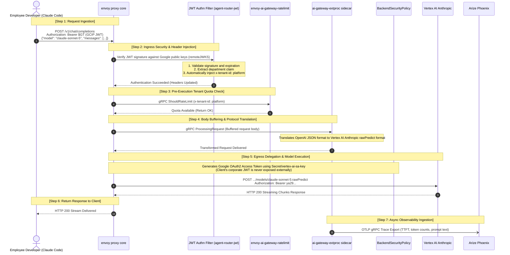
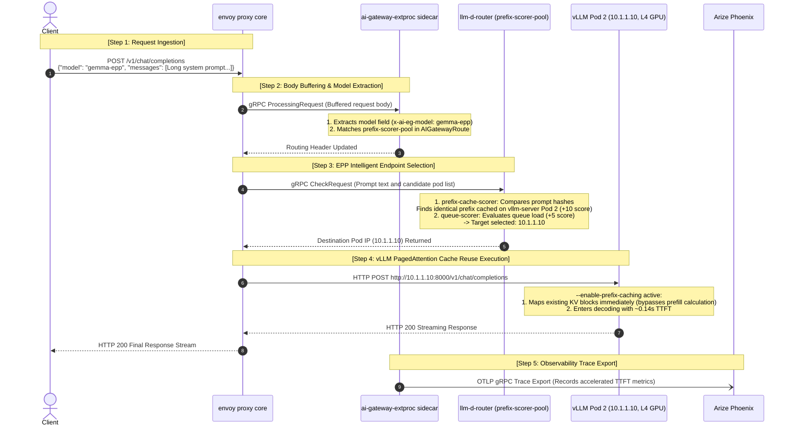
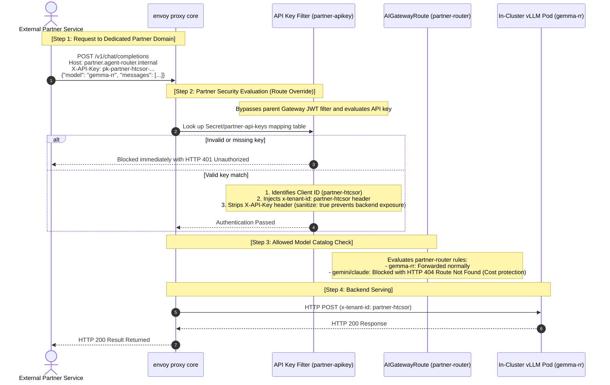
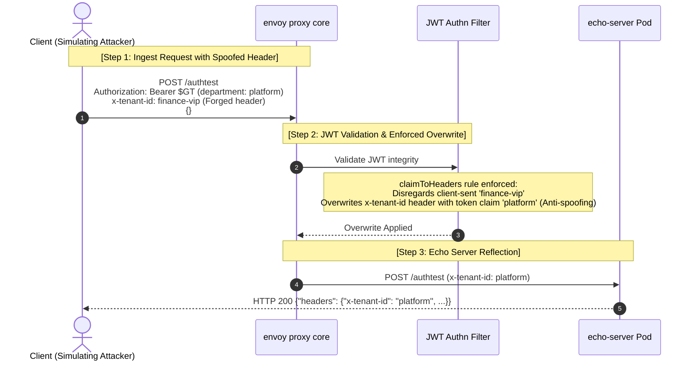

# Inference Request Flow Architecture with Envoy AI Gateway

> **Languages:** [English](architecture-request-flow.md) | [한국어](architecture-request-flow.kr.md)

This document provides a comprehensive end-to-end request processing architecture for Envoy AI Gateway ([Agentrouter](https://github.com/theagentrouter/agent-router)), Kubernetes Gateway API Inference Extension (GIE), llm-d-router (EPP), vLLM serving engines, Google Cloud Vertex AI (Gemini & Claude), Arize Phoenix observability, 3-tier multi-authentication (GCIP JWT, Google SA ID Token, Partner API Key), and Redis-backed dual rate limiting and quota policies deployed on Google Kubernetes Engine (GKE).

---

## 1. Component & Namespace Topology Diagram

Mapping of pods, policies, and networking paths traversed by different client personas:

```mermaid
flowchart TD
    classDef client fill:#f1f3f4,stroke:#5f6368,stroke-width:2px;
    classDef lb fill:#fef7e0,stroke:#fbbc04,stroke-width:2px;
    classDef envoy fill:#e8f0fe,stroke:#4285f4,stroke-width:2px;
    classDef sec fill:#fce8e6,stroke:#ea4335,stroke-width:2px;
    classDef route fill:#e6f4ea,stroke:#34a853,stroke-width:2px;
    classDef rls fill:#f3e8fd,stroke:#a142f4,stroke-width:2px;
    classDef backend fill:#e8eaed,stroke:#202124,stroke-width:2px;
    classDef obs fill:#e0f2f1,stroke:#00897b,stroke-width:2px;

    subgraph ClientLayer["1. Client Layer"]
        C_Emp["Corporate Employee / Claude Code\n(Authorization: Bearer GCIP JWT)"]:::client
        C_Workload["Internal Microservice\n(Authorization: Bearer Google SA Token)"]:::client
        C_Partner["External Partner Service\n(X-API-Key: pk-...)"]:::client
    end

    subgraph IngressLB["2. Ingress Entry Point"]
        ExtLB["GCP External Passthrough NLB\n(<GATEWAY_IP>:8080)"]:::lb
    end

    subgraph EnvoyNS["3. Proxy Data Plane (envoy-gateway-system)"]
        subgraph EnvoyPod["Envoy AI Gateway Pod"]
            EnvoyEngine["envoy core\n(L7 data plane)"]:::envoy
            ExtProc["ai-gateway-extproc\n(Body buffering, model parsing, OTel export)"]:::envoy
        end
        SP_JWT["SecurityPolicy: agent-router-jwt\n(Global Default: GCIP / Google SA JWT auth\nclaimToHeaders -> x-tenant-id injection)"]:::sec
        SP_Key["SecurityPolicy: partner-apikey\n(Partner Route Override:\nAPI Key auth -> forwardClientIDHeader)"]:::sec
        RLS_EG["envoy-ratelimit\n(BackendTrafficPolicy engine)"]:::rls
        RLS_AI["envoy-ai-gateway-ratelimit\n(QuotaPolicy engine)"]:::rls
    end

    subgraph StorageNS["4. Distributed State Store (redis-system)"]
        Redis["redis pod\n(Rate limit counters and quota windows)"]:::rls
    end

    subgraph RoutingLayer["5. Intelligent Routing Layer (routing)"]
        AIRoute_Emp["AIGatewayRoute: envoy-ai-gw-router\n(Default Domain: All models allowed)"]:::route
        AIRoute_Partner["AIGatewayRoute: partner-router\n(partner.agent-router.internal\ngemma-rr model only)"]:::route
        EchoRoute["HTTPRoute: authtest\n(/authtest header echo)"]:::route
    end

    subgraph BackendLayer["6. Backend Serving Layer"]
        subgraph CloudAI["Google Cloud Vertex AI"]
            BSP["BackendSecurityPolicy\n(Secret/vertex-ai-sa-key credentials)"]:::sec
            Gemini["Gemini 2.5 Flash\n(asia-southeast1)"]:::backend
            Claude["Claude Sonnet 5\n(global / GCPAnthropic)"]:::backend
        end

        subgraph VLLMNS["Self-Hosted GPU Cluster (vllm)"]
            EPP_Pref["llm-d-router\n(prefix-cache-scorer weight 10)"]:::backend
            EPP_Gen["llm-d-router-noprefix\n(queue-scorer weight 1)"]:::backend
            V1["vLLM Pod 1 (NVIDIA L4 24GB)\nvllm-server-4q9r4 (10.1.0.10)"]:::backend
            V2["vLLM Pod 2 (NVIDIA L4 24GB)\nvllm-server-995q2 (10.1.1.10)"]:::backend
        end

        subgraph EchoNS["Test Echo (routing)"]
            EchoServer["echo-server pod\n(Reflects headers as JSON)"]:::backend
        end
    end

    subgraph ObservabilityLayer["7. Enterprise Observability Layer"]
        Phoenix["Arize Phoenix (Port 6006)\nPersisted to Cloud SQL Postgres 16"]:::obs
        GMP["GMP Collector\nExport to Cloud Monitoring"]:::obs
    end

    %% Connections
    C_Emp --> ExtLB
    C_Workload --> ExtLB
    C_Partner --> ExtLB
    ExtLB --> EnvoyEngine

    EnvoyEngine <--> SP_JWT
    EnvoyEngine <--> SP_Key
    EnvoyEngine <-->|gRPC| ExtProc

    EnvoyEngine <-->|gRPC| RLS_EG
    EnvoyEngine <-->|gRPC| RLS_AI
    RLS_EG <--> Redis
    RLS_AI <--> Redis

    EnvoyEngine --> AIRoute_Emp
    EnvoyEngine --> AIRoute_Partner
    EnvoyEngine --> EchoRoute

    AIRoute_Emp -->|"model: gemini-2.5-flash"| BSP
    AIRoute_Emp -->|"model: claude-sonnet-5"| BSP
    BSP --> Gemini
    BSP --> Claude

    AIRoute_Emp -->|"model: gemma-epp"| EPP_Pref
    AIRoute_Emp -->|"model: gemma-epp-noprefix"| EPP_Gen
    AIRoute_Emp -->|"model: gemma-rr"| V1 & V2
    AIRoute_Partner -->|"model: gemma-rr"| V1 & V2
    EchoRoute --> EchoServer

    EPP_Pref -.->|Returns optimal Pod IP| EnvoyEngine
    EPP_Gen -.->|Returns optimal Pod IP| EnvoyEngine

    ExtProc -.->|OTLP gRPC Traces| Phoenix
    V1 & V2 -.->|Prometheus Metrics| GMP
```

---

## 2. Detailed End-to-End Sequence Diagrams

### 2.1 Scenario A: Corporate Employee / Claude Code invoking Vertex AI Claude

7-step sequence when an authenticated client requests `model: claude-sonnet-5` with a corporate GCIP JWT:

---

### 2.2 Scenario B: Gemma 2B EPP Prefix-Cache-Aware Routing

Sequence when a client sends a request with `model: gemma-epp` containing a long system prompt (>2,000 tokens):

---

### 2.3 Scenario C: External Partner API Key Authentication & Route Isolation

Sequence when an external partner accesses the gateway via dedicated credentials:

---

### 2.4 Scenario D: Security Header Anti-Spoofing Verification (`/authtest`)

Sequence illustrating gateway defense against client header tampering:

---

## 3. Pod & Configuration Role Mapping Table

| Pod / Component | Namespace | Applied Manifest Path | Role & Runtime Behavior |
|---|---|---|---|
| **`envoy` (Core Proxy)** | `envoy-gateway-system` | [`manifests/01-gateway/gateway.yaml`](../manifests/01-gateway/gateway.yaml) | Receives external LB (`:8080`) traffic and executes L7 routing decisions |
| **`ai-gateway-extproc`** | `envoy-gateway-system` | [`manifests/01-gateway/gateway-config.yaml`](../manifests/01-gateway/gateway-config.yaml) | Buffers request body, parses JSON `model`, and publishes OTLP gRPC traces |
| **`envoy-ratelimit`** | `envoy-gateway-system` | [`manifests/06-traffic-policy/traffic-policy.yaml`](../manifests/06-traffic-policy/traffic-policy.yaml) | Handles token-per-minute rate limits via `BackendTrafficPolicy` (EG xDS 18001) |
| **`envoy-ai-gateway-ratelimit`** | `envoy-gateway-system` | [`manifests/06-traffic-policy/traffic-policy.yaml`](../manifests/06-traffic-policy/traffic-policy.yaml) | Manages cumulative token budgets per model via `QuotaPolicy` (AI GW xDS 18002) |
| **`redis`** | `redis-system` | [`manifests/06-traffic-policy/redis.yaml`](../manifests/06-traffic-policy/redis.yaml) | Distributed in-memory storage for rate-limit counters and quota keys |
| **`SecurityPolicy` (JWT)** | `routing` | [`manifests/02-security/security-policy.yaml`](../manifests/02-security/security-policy.yaml) | Global verification for GCIP and Google SA tokens; injects `x-tenant-id` |
| **`SecurityPolicy` (API Key)** | `routing` | [`manifests/05-routing/partner-route.yaml`](../manifests/05-routing/partner-route.yaml) | Route-level API key verification and tenant mapping (overrides gateway default) |
| **`keyissuer`** | `routing` | [`manifests/02-security/keyissuer.yaml`](../manifests/02-security/keyissuer.yaml) | Dynamically patches new partner API keys into K8s Secret `partner-api-keys` |
| **`echo-server`** | `routing` | [`manifests/05-routing/echo-route.yaml`](../manifests/05-routing/echo-route.yaml) | Reflects received request headers as JSON to verify anti-spoofing behavior |
| **`AIGatewayRoute` (Internal)** | `routing` | [`manifests/05-routing/ai-gateway-route.yaml`](../manifests/05-routing/ai-gateway-route.yaml) | Allows full routing across Gemini, Claude, Gemma-RR, and EPP cache pools |
| **`AIGatewayRoute` (Partner)** | `routing` | [`manifests/05-routing/partner-route.yaml`](../manifests/05-routing/partner-route.yaml) | Restricts access to `gemma-rr` only for domain `partner.agent-router.internal` |
| **`BackendSecurityPolicy`** | `routing` | [`manifests/05-routing/ai-gateway-route.yaml`](../manifests/05-routing/ai-gateway-route.yaml) | Fetches Google OAuth2 tokens from `Secret/vertex-ai-sa-key` to call Vertex AI |
| **`llm-d-router` (EPP)** | `vllm` | [`manifests/04-inference-pool/llm-d-router.yaml`](../manifests/04-inference-pool/llm-d-router.yaml) | Scores pods using prompt prefix hashes to maximize KV cache reuse (`prefix-cache-scorer`) |
| **`vllm-server` (2 Pods)** | `vllm` | [`manifests/03-vllm/vllm-deployment.yaml`](../manifests/03-vllm/vllm-deployment.yaml) | Hosts Gemma 2B on NVIDIA L4 GPUs with V1 PagedAttention prefix caching enabled |
| **`phoenix`** | `phoenix` | [`manifests/07-observability/phoenix/`](../manifests/07-observability/phoenix/) | Persists OTLP traces into Cloud SQL Postgres 16 and serves the web UI (`:6006`) |
| **`gmp-collector`** | `gmp-system` | [`manifests/07-observability/podmonitoring.yaml`](../manifests/07-observability/podmonitoring.yaml) | Periodically scrapes vLLM `:8000/metrics` and exports to Google Cloud Monitoring |
