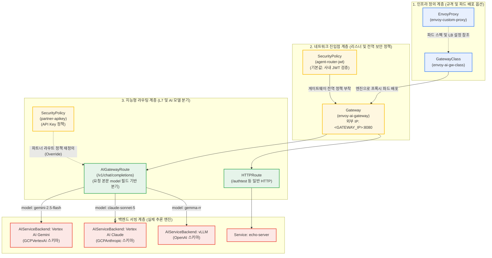

# Envoy AI Gateway 및 Kubernetes Gateway API 리소스 아키텍처

> **Languages:** [English](gateway-architecture-diagram.md) | [한국어](gateway-architecture-diagram.kr.md)

이 문서는 Kubernetes Gateway API, Envoy Gateway, Envoy AI Gateway(Agent Router)의 핵심 리소스 간 계층 구조와 동작 원리를 정리한 아키텍처 문서입니다.

---

## 1. 리소스 관계 및 계층 다이어그램



---

## 2. 리소스별 역할 및 클러스터 매핑

| 리소스 종류 | 역할 및 비유 | 실제 배포 리소스명 | 정의된 매니페스트 파일 경로 |
|---|---|---|---|
| **`GatewayClass`** | **건축 규격**: 클러스터에 설치된 인그레스 엔진을 지정합니다. | `envoy-ai-gw-class` | [`manifests/01-gateway/gateway-class.yaml`](../manifests/01-gateway/gateway-class.yaml) |
| **`EnvoyProxy`** | **시공 사양서**: 데이터 플레인 Envoy 파드의 CPU·메모리 자원, 복제본 수, 로깅 레벨, 외부 LoadBalancer 옵션을 정의합니다. | `routing/envoy-custom-proxy` | [`manifests/01-gateway/envoy-proxy.yaml`](../manifests/01-gateway/envoy-proxy.yaml) |
| **`Gateway`** | **건물 정문**: 실제 외부 트래픽을 수신하는 진입점입니다. 포트(8080)를 열고 GCP 외부 LoadBalancer IP를 할당받습니다. | `routing/envoy-ai-gateway`<br/>(외부 IP: `<GATEWAY_IP>`) | [`manifests/01-gateway/gateway.yaml`](../manifests/01-gateway/gateway.yaml) |
| **`SecurityPolicy`** | **보안 출입 검문소**: Gateway 또는 Route에 부착되어 JWT 서명 검증, API Key 인증, 테넌트 헤더 주입을 실행합니다. | `routing/agent-router-jwt`<br/>`routing/partner-apikey` | [`manifests/02-security/security-policy.yaml`](../manifests/02-security/security-policy.yaml)<br/>[`manifests/05-routing/partner-route.yaml`](../manifests/05-routing/partner-route.yaml) |
| **`HTTPRoute`** | **일반 경로 안내판**: 표준 URL 경로(`/authtest`)나 헤더를 기준으로 일반 K8s Service로 트래픽을 전달합니다. | `routing/authtest` | [`manifests/05-routing/echo-route.yaml`](../manifests/05-routing/echo-route.yaml) |
| **`AIGatewayRoute`** | **AI 전용 라우터**: HTTP 요청 본문(JSON)을 파싱하여 `model` 필드(`gemini-2.5-flash`, `gemma-rr`)를 읽은 뒤 적합한 AI 백엔드로 분기합니다. | `routing/envoy-ai-gw-router`<br/>`routing/partner-router` | [`manifests/05-routing/ai-gateway-route.yaml`](../manifests/05-routing/ai-gateway-route.yaml)<br/>[`manifests/05-routing/partner-route.yaml`](../manifests/05-routing/partner-route.yaml) |
| **`AIServiceBackend`** | **AI 백엔드 인터페이스**: 백엔드 프로토콜 스키마(OpenAI, GCPVertexAI, GCPAnthropic 등)를 선언하고 데이터 변환을 담당합니다. | `routing/vertex-ai-backend`<br/>`routing/vertex-ai-claude-backend`<br/>`routing/vllm-rr-backend`<br/>`routing/partner-vllm-backend` | [`manifests/05-routing/ai-gateway-route.yaml`](../manifests/05-routing/ai-gateway-route.yaml)<br/>[`manifests/05-routing/partner-route.yaml`](../manifests/05-routing/partner-route.yaml) |

---

## 3. 엔드투엔드 요청 처리 흐름

클라이언트가 게이트웨이 엔드포인트(`http://<GATEWAY_IP>:8080/v1/chat/completions`)로 추론 요청을 전송할 때 처리 순서입니다.

```
[클라이언트]
   │
   │  1. HTTP POST /v1/chat/completions (헤더: Authorization Bearer JWT)
   ▼
[Gateway: envoy-ai-gateway (<GATEWAY_IP>:8080)]
   │
   │  2. SecurityPolicy 검증:
   │     - JWT 서명 검증 (Google/GCIP 공개키 대조)
   │     - 토큰 클레임 추출 후 x-tenant-id 헤더 주입
   ▼
[AIGatewayRoute: envoy-ai-gw-router]
   │
   │  3. 요청 본문(Body) 버퍼링 및 모델 파싱:
   │     - JSON 파싱을 거쳐 model 값 확인
   │
   ├─ model == "gemini-2.5-flash" ──┐
   │                                 │
   ├─ model == "claude-sonnet-5" ───┼─┐
   │                                 │ │
   └─ model == "gemma-rr" ───┐       │ │
                             │       ▼ │
                             │  [AIServiceBackend: vertex-ai-backend]
                             │     - OpenAI 규격 요청을 GCP Vertex AI Gemini 규격으로 변환
                             │     - BackendSecurityPolicy 자격증명으로 Google OAuth2 토큰 생성
                             │     - Vertex AI Gemini 호출
                             │
                             │       ▼
                             │  [AIServiceBackend: vertex-ai-claude-backend]
                             │     - OpenAI/Anthropic 규격 요청을 GCP Vertex AI Claude 규격으로 변환
                             │     - BackendSecurityPolicy 자격증명으로 Google OAuth2 토큰 생성
                             │     - Vertex AI Anthropic Claude 호출
                             │
                             ▼
                        [AIServiceBackend: vLLM / InferencePool]
                           - 내부 GPU 노드의 vLLM Pod로 로드밸런싱 전달
```

---

## 4. 정책 상속 및 재정의(Override) 규칙

Gateway API의 Policy Attachment 설계 규칙에 따라 상위 계층과 하위 계층 간 정책이 조율됩니다.

1. **Gateway 계층 정책 (`agent-router-jwt`)**:
   - `targetRefs`가 `Gateway`를 가리킵니다.
   - 이 게이트웨이에 연결된 모든 하위 라우트가 기본값(Default)으로 사내 JWT 인증을 상속받습니다.
   - 인증되지 않은 라우트가 외부에 무단 노출되는 상황을 방지합니다.

2. **HTTPRoute 계층 정책 (`partner-apikey`)**:
   - `targetRefs`가 특정 `HTTPRoute`(`partner-router`)를 가리킵니다.
   - Gateway API 규격에 따라 하위 계층(Route)의 정책이 상위 계층(Gateway)의 정책을 덮어씁니다(Override).
   - 따라서 파트너 전용 도메인으로 들어오는 요청은 상위 JWT 검사를 건너뛰고 전용 API Key 검사만 수행합니다.
