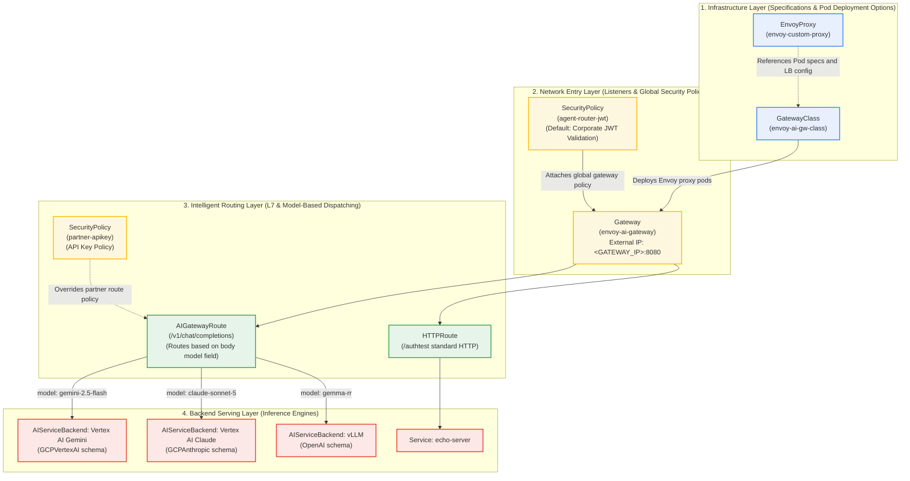

# Resource Architecture: Envoy AI Gateway & Kubernetes Gateway API

> **Languages:** [English](gateway-architecture-diagram.md) | [한국어](gateway-architecture-diagram.kr.md)

This document provides an architectural overview of the core resources and hierarchy across the Kubernetes Gateway API, Envoy Gateway, and Envoy AI Gateway ([Agentrouter](https://github.com/theagentrouter/agent-router)).

---

## 1. Resource Relationships & Layer Diagram



---

## 2. Resource Roles & Cluster Mapping

| Resource Type | Role & Metaphor | Deployed Resource Name | Manifest File Path |
|---|---|---|---|
| **`GatewayClass`** | **Building Code**: Defines the ingress controller engine installed in the cluster. | `envoy-ai-gw-class` | [`manifests/01-gateway/gateway-class.yaml`](../manifests/01-gateway/gateway-class.yaml) |
| **`EnvoyProxy`** | **Construction Spec**: Specifies Envoy data-plane pod CPU/memory requests, replicas, log level, and external LoadBalancer options. | `routing/envoy-custom-proxy` | [`manifests/01-gateway/envoy-proxy.yaml`](../manifests/01-gateway/envoy-proxy.yaml) |
| **`Gateway`** | **Building Main Entrance**: External entry point listening on port 8080 and provisioned with a GCP external LoadBalancer IP. | `routing/envoy-ai-gateway`<br/>(External IP: `<GATEWAY_IP>`) | [`manifests/01-gateway/gateway.yaml`](../manifests/01-gateway/gateway.yaml) |
| **`SecurityPolicy`** | **Security Checkpoint**: Attached to the Gateway or Route to execute JWT verification, API key authentication, and tenant header injection. | `routing/agent-router-jwt`<br/>`routing/partner-apikey` | [`manifests/02-security/security-policy.yaml`](../manifests/02-security/security-policy.yaml)<br/>[`manifests/05-routing/partner-route.yaml`](../manifests/05-routing/partner-route.yaml) |
| **`HTTPRoute`** | **Standard Signpost**: Routes traffic based on standard URL paths (`/authtest`) or headers to regular Kubernetes Services. | `routing/authtest` | [`manifests/05-routing/echo-route.yaml`](../manifests/05-routing/echo-route.yaml) |
| **`AIGatewayRoute`** | **AI-Aware Router**: Buffers and parses the JSON request body, reads the `model` field (`gemini-2.5-flash`, `gemma-rr`), and dispatches to the optimal AI backend. | `routing/envoy-ai-gw-router`<br/>`routing/partner-router` | [`manifests/05-routing/ai-gateway-route.yaml`](../manifests/05-routing/ai-gateway-route.yaml)<br/>[`manifests/05-routing/partner-route.yaml`](../manifests/05-routing/partner-route.yaml) |
| **`AIServiceBackend`** | **AI Backend Interface**: Declares target backend protocol schemas (OpenAI, GCPVertexAI, GCPAnthropic) and handles protocol translation. | `routing/vertex-ai-backend`<br/>`routing/vertex-ai-claude-backend`<br/>`routing/vllm-rr-backend`<br/>`routing/partner-vllm-backend` | [`manifests/05-routing/ai-gateway-route.yaml`](../manifests/05-routing/ai-gateway-route.yaml)<br/>[`manifests/05-routing/partner-route.yaml`](../manifests/05-routing/partner-route.yaml) |

---

## 3. End-to-End Request Processing Flow

Sequence of operations when a client sends an inference request to `http://<GATEWAY_IP>:8080/v1/chat/completions`:

```
[Client]
   │
   │  1. HTTP POST /v1/chat/completions (Header: Authorization Bearer JWT)
   ▼
[Gateway: envoy-ai-gateway (<GATEWAY_IP>:8080)]
   │
   │  2. SecurityPolicy Validation:
   │     - Validates JWT signature against Google/GCIP public keys
   │     - Extracts token claims and injects x-tenant-id header
   ▼
[AIGatewayRoute: envoy-ai-gw-router]
   │
   │  3. Body Buffering & Model Parsing:
   │     - Parses JSON payload to inspect the model field
   │
   ├─ model == "gemini-2.5-flash" ──┐
   │                                 │
   ├─ model == "claude-sonnet-5" ───┼─┐
   │                                 │ │
   └─ model == "gemma-rr" ───┐       │ │
                             │       ▼ │
                             │  [AIServiceBackend: vertex-ai-backend]
                             │     - Translates OpenAI-compatible schema to Vertex AI Gemini
                             │     - Obtains Google OAuth2 token via BackendSecurityPolicy credentials
                             │     - Calls Google Cloud Vertex AI Gemini API
                             │
                             │       ▼
                             │  [AIServiceBackend: vertex-ai-claude-backend]
                             │     - Translates schema to Vertex AI Anthropic Claude
                             │     - Obtains Google OAuth2 token via BackendSecurityPolicy credentials
                             │     - Calls Vertex AI Anthropic Claude API
                             │
                             ▼
                        [AIServiceBackend: vLLM / InferencePool]
                           - Dispatches request to in-cluster GPU vLLM pods
```

---

## 4. Policy Inheritance & Override Rules

Policy attachment follows standard Kubernetes Gateway API rules across architectural tiers:

1. **Gateway-Level Policy (`agent-router-jwt`)**:
   - `targetRefs` points to the `Gateway`.
   - All child routes attached to this Gateway inherit corporate JWT authentication by default.
   - Prevents unauthenticated routes from unintended exposure.

2. **Route-Level Policy (`partner-apikey`)**:
   - `targetRefs` points to a specific `HTTPRoute` (`partner-router`).
   - Route-level policies override gateway-level policies according to Gateway API specifications.
   - Requests arriving at the partner domain bypass standard corporate JWT evaluation and enforce strict API key validation.
