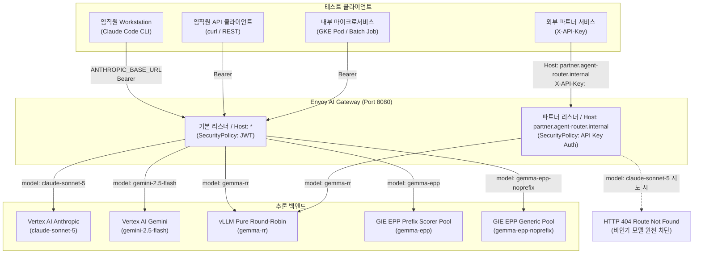

# Envoy AI Gateway 수동 테스트 가이드 (시나리오별 점검 절차)

> **Languages:** [English](manual-test-guide.md) | [한국어](manual-test-guide.kr.md)

GKE 상에 구축된 Envoy AI Gateway(Agent Router), vLLM, GIE/EPP(llm-d-router),
다계층 인증(GCIP·Workload Identity·API 키), 파트너 쿼터 격리 및 Arize Phoenix 관측성
파이프라인을 운영자가 직접 검증하는 상세 절차입니다.

---

## 0. 테스트 아키텍처 및 경로 개요

Envoy AI Gateway는 단일 게이트웨이 엔드포인트에서 클라이언트 유형과 요청 조건에 맞춰
트래픽을 분기하고 인가를 수행합니다.



---

## 1. 사전 환경 변수 설정

테스트를 진행할 로컬 셸 환경에서 아래 변수를 선언합니다.

```bash
# 게이트웨이 외부 접속 주소
export GW="http://$(kubectl get gateway envoy-ai-gateway -n routing -o jsonpath='{.status.addresses[0].value}' 2>/dev/null || echo <GATEWAY_IP>):8080"
export PARTNER_HOST="partner.agent-router.internal"
export GCP_PROJECT="${GCP_PROJECT:-<YOUR_PROJECT_ID>}"

# 공인 IP 직접 접근이 제한된 망인 경우 포트포워딩 백그라운드 실행
# kubectl port-forward -n envoy-gateway-system svc/envoy-routing-envoy-ai-gateway-add85b85 8080:8080 &
# export GW="http://localhost:8080"
```

---

## 2. 시나리오 1: 사내 임직원 업무 환경 (Cloud Workstation Claude Code)

사내 임직원이 Cloud Workstation 상에서 `claude` CLI를 사용할 때
게이트웨이가 GCIP 토큰을 검증한 뒤 Vertex AI의 `claude-sonnet-5`로 전달하는 환경을 검증합니다.

### 2.1 워크스테이션 접속 및 설정 점검

1. Cloud Workstation 인스턴스에 SSH로 접속합니다.
   ```bash
   gcloud workstations ssh <YOUR_WORKSTATION_NAME> \
     --project=$GCP_PROJECT \
     --region=asia-northeast3 \
     --cluster=<YOUR_WORKSTATION_CLUSTER> \
     --config=<YOUR_WORKSTATION_CONFIG>
   ```

2. Claude Code 환경 설정을 확인합니다.
   ```bash
   cat ~/.claude/settings.json
   ```
   **기대 설정값**:
   - `"ANTHROPIC_BASE_URL": "http://<GATEWAY_IP>:8080/anthropic"`
   - `"apiKeyHelper": "/home/user/bin/gcip-token.sh alice platform"`
   - `"ANTHROPIC_MODEL": "claude-sonnet-5"`
   - `"model": "claude-sonnet-5"`
   - `CLAUDE_CODE_USE_VERTEX` 환경 변수가 없어야 합니다 (있으면 게이트웨이 주소를 무시합니다).
   - `env.ANTHROPIC_AUTH_TOKEN`이 없어야 합니다 (있으면 `apiKeyHelper`가 무시되고 만료 시 401 오류가 발생합니다).

### 2.2 단발성 및 상호작용 프롬프트 실행

1. 단발성 질의를 실행합니다.
   ```bash
   claude -p '안녕! 3단어로 답해줘'
   ```
   - **기대 결과**: 약 2~4초 내에 정상 응답(예: `안녕하세요, 반갑습니다!`) 출력.

2. 연속 호출을 실행하여 토큰 레이트리밋(분당 50만 토큰 한도) 정상 동작을 확인합니다.
   ```bash
   claude -p 'say OK 1' && claude -p 'say OK 2'
   ```
   - **기대 결과**: 두 요청 모두 429 지연 없이 연속 성공.

### 2.3 게이트웨이 유입 및 변환 로그 확인

Cloud Workstation이 보낸 요청이 게이트웨이에서 어떻게 변환되어 Vertex AI로 중계되었는지 Envoy 액세스 로그로 점검합니다.
```bash
kubectl logs -n envoy-gateway-system \
  -l gateway.envoyproxy.io/owning-gateway-name=envoy-ai-gateway \
  --tail=5
```
- **확인 지표**:
  - `user-agent`: `claude-cli/...`
  - `response_code`: `200`
  - `x-envoy-origin-path`: `/v1/projects/<YOUR_PROJECT_ID>/locations/global/publishers/anthropic/models/claude-sonnet-5:streamRawPredict`

---

## 3. 시나리오 2: 사내 임직원 직접 API 호출 (curl / REST)

개발팀 직원이 curl을 사용하여 REST API로 직접 모델을 호출한 뒤
게이트웨이가 부서 헤더 위조를 원천 차단하는 과정을 검증합니다.

### 3.1 GCIP ID 토큰 발급

`scripts/gcip-token.sh` 스크립트를 실행해 1시간 유효한 GCIP ID 토큰을 얻습니다.
```bash
# 사용자 alice, 소속 부서 platform 명의 토큰 발급
export GT=$(./scripts/gcip-token.sh alice platform)
echo "토큰 길이: ${#GT}"
```

### 3.2 Vertex AI Claude 3.5 Sonnet 호출 (OpenAI 호환 규격)

```bash
curl -sS -X POST "$GW/v1/chat/completions" \
  -H "Authorization: Bearer $GT" \
  -H "Content-Type: application/json" \
  -d '{
    "model": "claude-sonnet-5",
    "messages": [{"role": "user", "content": "Explain Rate Limiting in 10 words."}],
    "max_tokens": 30
  }' | jq .
```
- **기대 결과**: HTTP `200 OK`, `model` 필드에 `claude-sonnet-5` 표기.

### 3.3 Vertex AI Claude 3.5 Sonnet 호출 (Anthropic 네이티브 Messages 규격)

```bash
curl -sS -X POST "$GW/anthropic/v1/messages" \
  -H "Authorization: Bearer $GT" \
  -H "Content-Type: application/json" \
  -d '{
    "model": "claude-sonnet-5",
    "messages": [{"role": "user", "content": "Say OK"}],
    "max_tokens": 10
  }' | jq .
```
- **기대 결과**: HTTP `200 OK`, `type` 필드에 `message`, `content[0].text`에 생성 결과 표기.

### 3.4 Vertex AI Gemini 2.5 Flash 호출

```bash
curl -sS -X POST "$GW/v1/chat/completions" \
  -H "Authorization: Bearer $GT" \
  -H "Content-Type: application/json" \
  -d '{
    "model": "gemini-2.5-flash",
    "messages": [{"role": "user", "content": "Kubernetes Gateway API 장점을 한 줄로 요약해줘."}],
    "max_tokens": 1500
  }' | jq .
```
- **기대 결과**: HTTP `200 OK`, 클라이언트가 별도 GCP IAM 권한이나 API 키를 갖지 않아도 게이트웨이가 백엔드 자격증명으로 Vertex AI를 대리 호출하여 응답 반환.
  (참고: 클라이언트가 전송하는 `Authorization: Bearer $GT`는 게이트웨이 인그레스 보안 관문을 통과하는 사내 JWT 신원 증명이며, Vertex AI 백엔드 호출 시에는 게이트웨이가 자체 `BackendSecurityPolicy` 자격증명을 사용합니다.)

### 3.5 보안 검증: 클라이언트 헤더 위조 방어 (x-tenant-id Override)

> [!NOTE]
> `/authtest` 경로는 게이트웨이 자체 내장 기능이 아닙니다. 게이트웨이가 백엔드로 전달하는 최종 HTTP 헤더를 검증하기 위해 오픈소스 에코 서버(`mendhak/http-https-echo`)와 `HTTPRoute/authtest` 매니페스트([echo-route.yaml](../manifests/05-routing/echo-route.yaml))로 구성한 테스트 전용 엔드포인트입니다. 게이트웨이 보안 정책(`SecurityPolicy`)을 동일하게 거칩니다.

클라이언트가 요청 헤더에 임의로 부서명(`x-tenant-id: finance-vip`)을 실어 보내더라도
Envoy Gateway가 JWT 클레임(`department: platform`)으로 강제 덮어쓰는지 점검합니다.

```bash
curl -sS -X POST "$GW/authtest" \
  -H "Authorization: Bearer $GT" \
  -H "x-tenant-id: finance-vip" \
  -H "Content-Type: application/json" \
  -d '{}' | jq .headers
```
- **기대 결과**: 에코 서버 수신 헤더의 `"x-tenant-id"`가 클라이언트 입력값(`finance-vip`)이 아니라
  토큰 클레임인 `"platform"`으로 기록되어야 합니다. (에코 서버 JSON 파서 규격상 `-d '{}'` 본문 전달 필요)

---

## 4. 시나리오 3: 내부 마이크로서비스 및 백엔드 워크로드 (Google SA Token)

GKE 내부에서 동작하는 마이크로서비스나 배치 파드가 정적 키 없이
Workload Identity SA ID 토큰을 활용해 사내 호스팅 모델(`gemma-rr`)을 호출하는 절차입니다.

### 4.1 메타데이터 기반 SA ID 토큰 발급 및 호출

로컬 터미널에서는 SA 가장(impersonation)으로 동일 규격의 토큰을 생성하여 호출합니다.
```bash
# Google SA ID 토큰 발급 (Audience 지정 및 email 포함 필수)
export SA_EMAIL="${SA_EMAIL:-<YOUR_SERVICE_ACCOUNT>@${GCP_PROJECT}.iam.gserviceaccount.com}"
export SA_TOKEN=$(gcloud auth print-identity-token \
  --impersonate-service-account="$SA_EMAIL" \
  --audiences=https://agent-router.internal \
  --include-email 2>/dev/null)

# 사내 호스팅 Gemma 2B 모델 호출
curl -sS -X POST "$GW/v1/chat/completions" \
  -H "Authorization: Bearer $SA_TOKEN" \
  -H "Content-Type: application/json" \
  -d '{
    "model": "gemma-rr",
    "messages": [{"role": "user", "content": "Healthcheck from microservice"}],
    "max_tokens": 15
  }' | jq .
```
- **기대 결과**: HTTP `200 OK`, `system_fingerprint`에 `vllm-0.29.0` 표기.
- 게이트웨이가 토큰의 `email` 클레임을 읽어 백엔드 `x-tenant-id` 헤더에 주체 이메일을 자동 주입합니다.

### 4.2 보안 검증: Google SA 이메일 헤더 주입 확인 (/authtest)

게이트웨이 `SecurityPolicy`의 `claimToHeaders` 규칙에 따라
Google SA 토큰의 `email` 클레임이 백엔드 `x-tenant-id` 헤더로 자동 주입되었는지 에코 엔드포인트로 점검합니다.

```bash
curl -sS -X POST "$GW/authtest" \
  -H "Authorization: Bearer $SA_TOKEN" \
  -H "Content-Type: application/json" \
  -d '{}' | jq .headers
```
- **기대 결과**: 에코 서버 수신 헤더의 `"x-tenant-id"`에
  서비스 계정 주체 이메일(`$SA_EMAIL`)이 기록되어야 합니다.

---

## 5. 시나리오 4: 외부 파트너 서비스 연동 (API 키 & 쿼터 격리)

조직 외부의 파트너사가 사전에 발급받은 API 키로 게이트웨이에 접근할 때
인가된 모델만 호출할 수 있고 파트너별 분당 토큰 예산이 엄격히 격리되는지 검증합니다.

### 5.1 사전 배포된 파트너 API 키 확인

```bash
export AK=$(kubectl get secret partner-api-keys -n routing -o jsonpath='{.data.acme-corp}' | base64 -d)
export GK=$(kubectl get secret partner-api-keys -n routing -o jsonpath='{.data.globex}' | base64 -d)

echo "Acme Corp 키: $AK"
echo "Globex 키:    $GK"
```

### 5.2 데모 키 발급 서비스(Key Issuer) 실시간 키 발급 테스트

`keyissuer` 서비스를 활용해 새로운 임의 파트너 키를 즉석 발급받습니다.
```bash
kubectl exec -n routing deploy/keyissuer -- python3 /app/client.py | jq .
```
- **기대 결과**: `{"client_id": "partner-...", "api_key": "pk-partner-...", "status": "success"}`가 반환된 뒤
  K8s Secret `partner-api-keys`에 해당 키가 즉시 동기화됩니다.

### 5.3 파트너 정상 추론 호출 (`gemma-rr`)

파트너 전용 호스트명(`partner.agent-router.internal`)을 `Host` 헤더에 지정합니다.
```bash
curl -sS -X POST "$GW/v1/chat/completions" \
  -H "Host: $PARTNER_HOST" \
  -H "X-API-Key: $AK" \
  -H "Content-Type: application/json" \
  -d '{
    "model": "gemma-rr",
    "messages": [{"role": "user", "content": "Partner integration verification"}],
    "max_tokens": 16
  }' | jq .
```
- **기대 결과**: HTTP `200 OK`, 정상 응답 텍스트 수신.

### 5.4 비인가 모델 차단 검증 (모델 허용목록 통제)

파트너가 비용이 높은 비인가 모델(`claude-sonnet-5`)을 요청하는 경우 차단되는지 확인합니다.
```bash
curl -sS -i -X POST "$GW/v1/chat/completions" \
  -H "Host: $PARTNER_HOST" \
  -H "X-API-Key: $AK" \
  -H "Content-Type: application/json" \
  -d '{
    "model": "claude-sonnet-5",
    "messages": [{"role": "user", "content": "Unauthorized request"}],
    "max_tokens": 10
  }'
```
- **기대 결과**: HTTP `404 Not Found`
- **본문**: `No matching route found. It is likely because the model specified in your request is not configured in the Gateway.`

### 5.5 파트너별 쿼터 분리 및 격리 실측 (QuotaPolicy)

- `acme-corp` 한도: 분당 **60 토큰** (요청당 약 15~17 토큰 소비)
- `globex` 한도: 분당 **500 토큰**

1. **`acme-corp` 쿼터 소진 유도 (연속 6회 호출)**:
   ```bash
   for i in $(seq 1 6); do
     code=$(curl -sS -o /dev/null -w "%{http_code}" -X POST "$GW/v1/chat/completions" \
       -H "Host: $PARTNER_HOST" \
       -H "X-API-Key: $AK" \
       -H "Content-Type: application/json" \
       -d '{"model":"gemma-rr","messages":[{"role":"user","content":"Say OK please"}],"max_tokens":16}')
     echo "acme-corp 요청 #$i 결과 코드: $code"
   done
   ```
   - **기대 결과**: #1~#4 요청은 `200 OK`, #5번째부터 한도(60 토큰)가 초과되어 `429 Too Many Requests` 반환.

2. **`globex` 격리 확인 (Acme가 차단된 직후 호출)**:
   ```bash
   curl -sS -i -X POST "$GW/v1/chat/completions" \
     -H "Host: $PARTNER_HOST" \
     -H "X-API-Key: $GK" \
     -H "Content-Type: application/json" \
     -d '{"model":"gemma-rr","messages":[{"role":"user","content":"Globex check"}],"max_tokens":16}'
   ```
   - **기대 결과**: Acme가 차단된 동일 시점에도 Globex는 독자 버킷(500 토큰)을 가지므로 HTTP `200 OK` 통과.

---

## 6. 시나리오 5: Gemma 동적 라우팅 및 EPP Prefix Cache 가속 체감

동일한 긴 시스템 프롬프트(약 1,500 토큰)를 주입할 때
EPP Prefix Scorer가 문맥 캐시를 보유한 특정 Pod로 지능형 분산하여
TTFT가 급격히 단축되는 현상을 직접 측정합니다.

### 6.1 테스트 페이로드 생성

공통 긴 문맥을 담은 두 개의 요청 파일을 생성합니다.
```bash
cat << 'EOF' > /tmp/make_payload.py
import json

prefix = "This is enterprise shared context for Envoy AI Gateway and GIE testing. " * 150

req1 = {
    "model": "gemma-epp",
    "messages": [{"role": "user", "content": prefix + "\nQuestion 1: What is Gateway API?"}],
    "stream": True,
    "max_tokens": 20
}
req2 = {
    "model": "gemma-epp",
    "messages": [{"role": "user", "content": prefix + "\nQuestion 2: What is Prefix Caching?"}],
    "stream": True,
    "max_tokens": 20
}

with open('/tmp/prefix_q1.json', 'w') as f: json.dump(req1, f)
with open('/tmp/prefix_q2.json', 'w') as f: json.dump(req2, f)
print("생성 완료: /tmp/prefix_q1.json, /tmp/prefix_q2.json")
EOF
python3 /tmp/make_payload.py
```

### 6.2 Gemma EPP 지능형 라우팅 가속 측정

1. **1차 요청 (Cold Miss)**:
   ```bash
   curl -N -s -X POST "$GW/v1/chat/completions" \
     -H "Authorization: Bearer $GT" \
     -H "Content-Type: application/json" \
     -d @/tmp/prefix_q1.json \
     -w "\n[1차 Cold TTFT]: %{time_starttransfer}s | [전체 시간]: %{time_total}s\n"
   ```
   - **관측치**: 1,500 토큰 Prefill 연산으로 인해 TTFT가 약 **0.8s~1.2s** 소요됩니다.

2. **2차 요청 (Warm Cache Hit)**:
   ```bash
   curl -N -s -X POST "$GW/v1/chat/completions" \
     -H "Authorization: Bearer $GT" \
     -H "Content-Type: application/json" \
     -d @/tmp/prefix_q2.json \
     -w "\n[2차 Warm TTFT]: %{time_starttransfer}s | [전체 시간]: %{time_total}s\n"
   ```
   - **관측치**: EPP가 프롬프트 접두사 해시를 평가하여 1차 요청을 처리했던 Pod로 자동 유도합니다.
     TTFT가 약 **0.14s 수준으로 단축되어 5배 이상의 가속**을 보입니다.

3. **vLLM Pod별 캐시 메트릭 확인**:
   ```bash
   for POD in $(kubectl get pods -n vllm -l app=vllm-server -o jsonpath='{.items[*].metadata.name}'); do
     echo "=== Pod: $POD ==="
     kubectl exec -n vllm $POD -c vllm -- curl -s http://localhost:8000/metrics \
       | grep -E "vllm:prefix_cache_hits_total"
   done
   ```
   - 1차 요청을 처리한 Pod에서만 `vllm:prefix_cache_hits_total` 수치가 약 1,500 토큰 증가합니다.

---

## 7. 시나리오 6: 통합 관측성(Observability) 점검

### 7.1 Arize Phoenix 대시보드 점검

1. Phoenix 웹 UI 서비스 포트포워딩을 실행합니다.
   ```bash
   kubectl port-forward -n phoenix svc/phoenix-service 6006:6006
   ```

2. 브라우저에서 `http://localhost:6006`에 접속한 뒤 `default` 프로젝트의 `Traces` 메뉴를 클릭합니다.
   - 방금 실행한 추론 요청들이 OpenInference 규격의 OTLP 스팬으로 수집되었는지 확인합니다.
   - 스팬 속성(`Attributes`)에서 `llm.token_count.prompt`, `llm.token_count.completion`, `Duration` 지표를 점검합니다.

### 7.2 Google Cloud Monitoring 대시보드 점검

1. 웹 브라우저로 커스텀 대시보드에 접속합니다.
   - **URL**: `https://console.cloud.google.com/monitoring/dashboards?project=<YOUR_PROJECT_ID>` (또는 대시보드 목록에서 `vLLM Model Server Monitoring` 선택)
   - **명칭**: `vLLM Model Server Monitoring`

2. 핵심 차트 및 위젯 확인:
   - `Prefix Cache Hit Rate %`: 실시간 접두사 캐시 적중률 게이지
   - `vLLM Prefix Cache Hits & Queries`: 시간대별 적중 횟수 시계열 그래프
   - `vLLM Time to First Token (TTFT) Latency`: P50 / P95 TTFT 레이턴시 곡선

---

## 8. 시나리오 7: 비정상 요청 및 보안 거절 (Edge Cases)

게이트웨이 보안 정책이 부적격 요청을 안전하게 차단하는지 검증합니다.

| 테스트 유형 | 실행 명령 | 기대 응답 | 판정 기준 |
|---|---|---|---|
| **무인증 익명 요청** | `curl -i -s -X POST $GW/v1/chat/completions -H 'Content-Type: application/json' -d '{"model":"gemma-rr"}'` | `HTTP 401 Unauthorized` | `Jwt is missing` |
| **위조 JWT 토큰** | `curl -i -s -X POST $GW/v1/chat/completions -H 'Authorization: Bearer bad-token' -d '{"model":"gemma-rr"}'` | `HTTP 401 Unauthorized` | `invalid_token` |
| **틀린 파트너 키** | `curl -i -s -X POST $GW/v1/chat/completions -H "Host: $PARTNER_HOST" -H 'X-API-Key: wrong-key' -d '{"model":"gemma-rr"}'` | `HTTP 401 Unauthorized` | `Client authentication failed.` |
| **Host 헤더 누락** | `curl -i -s -X POST $GW/v1/chat/completions -H 'X-API-Key: pk-acme-001' -d '{"model":"gemma-rr"}'` | `HTTP 401 Unauthorized` | 기본 리스너로 유입되어 `Jwt is missing` 차단 |

---

## 9. 문제 해결 및 점검 팁

1. **`HTTP 429`가 발생하며 요청이 막힐 때**:
   - `claude-sonnet-5`: 사내 쿼터(분당 50만 토큰)가 소진되었는지 확인합니다. 1분이 경과한 뒤 자동 복구됩니다.
   - 파트너 호출: `acme-corp`는 분당 60토큰 한도이므로 1분 후 재시도하거나 `globex` 키를 사용합니다.

2. **Workstation에서 Claude Code 실행 시 게이트웨이를 경유하지 않을 때**:
   - `env | grep CLAUDE_CODE_USE_VERTEX`를 확인하여 설정되어 있다면 `unset CLAUDE_CODE_USE_VERTEX`로 제거합니다.
   - `~/.claude/settings.json`의 `ANTHROPIC_BASE_URL` 값이 게이트웨이 주소인지 확인합니다.

3. **QuotaPolicy 수정 사항이 Envoy에 즉시 반영되지 않을 때**:
   - Envoy Gateway 컨트롤러를 재시작하여 xDS 설정을 재조정합니다.
   ```bash
   kubectl rollout restart deployment/envoy-gateway -n envoy-gateway-system
   kubectl rollout status deployment/envoy-gateway -n envoy-gateway-system --timeout=180s
   ```
